# Mini-Project_Git_VCS_Basics
## Version Control System and it's importance
### What is Git?
Git is a free and open-source version control system that helps developers track changes in their code, collaborate with others, and manage different versions of a project efficiently.

## Why Git?
- **Improved collaboration:** It helps you stay organized, collaborate efficiently and effectively 
- **Prevents accidental code loss:** Allows for easy rollback to previous versions, minimizing the impact of mistakes. 
- **Increased productivity:** Streamlines development workflows and enables faster iterations. 
- **Enhanced code quality:** By tracking changes and enabling code reviews.

## Conceptualizing Git Set Up with Tom and Jerry.

1. Initial SetUp: 

- Both Tom Jerry have Git installed on their computers.

- They clone (or download) the project repository from a central reposotory (like [GitHub](https://github.com/home), [GitLab](https://gitlab.com/users/sign_in), or [Bitbucket](https://bitbucket.org/product)) to their local machines. This gives them each a complete copy of the project, including all its files and version history. 

2. Tom and Jerry Start Working: 

- Tom and Jerry pull the latest changes from the central repository to ensure they start with the most recent version of the **index.html** file. 
- They both create a new branch from the main project. A branch in Git allows developers to work on a a copy of the codebase without affecting the main line of development. Tom names his branch **update-navigation**, and Jerry names his **add-contact-info**. 

3. Making Changes: 

- On his branch, Tom update the navigation bar in **index.html**. 
- Simultaneously, Jerry works on his branch to add contact information to the footer of the same file. 
- They commit their changes to their respective branches. A commit in Git is like saving your work with a note about what you have done. 

4. Merging Changes: 
- Once they're done, Tom and Jerry push their branches to the central repository.
- Tom decides to merge his changes first. He creates a **pull request (PR)** for his branch **update-navigation**. A PR is a way to tell the team that he's done and his code is ready to be reviewed and merged into the main project. 
- After reviewing Tom's changes, the team merges his PR into the main branch, updating the **index.html** file on the main project line.
- Jerry updates his branch with the latest changes from the main project to include Tom's updates. This steps is crucial to ensure that Jerry is working with and integrating his changes into the most current version of the project.
- Jerry resolves any conflicts that arise from Tom's changes and his own. Git provides tools and commands to help resolve these conflicts.
- Jerry pushes his updated branch and creates a PR for his changes. The team reviews Jerry's additions, and once they are approved, his changes are merged into the main project.  

## Project Initial Setup

1. Creating a webpage in index.html file for Tom and Jerry to work on. 

- Open the terminal and a working directory and create a folder for the project,

 

- Changing directory to the project folder after cloning the repo from GitHub. 

 

- Creating index.html file. 

 

- Filing index.html using vim as a text editor. 

 

- Writing the a simple html code for a website using the vim editor. 

 

- Adding, Committing and pushing all the files images, index.html

 

 

## Tom and Jerry Collaborations

- **Step 1:** 
Ensures git is installed in both machines, then Change directory to the project folder and clone the central repository. 

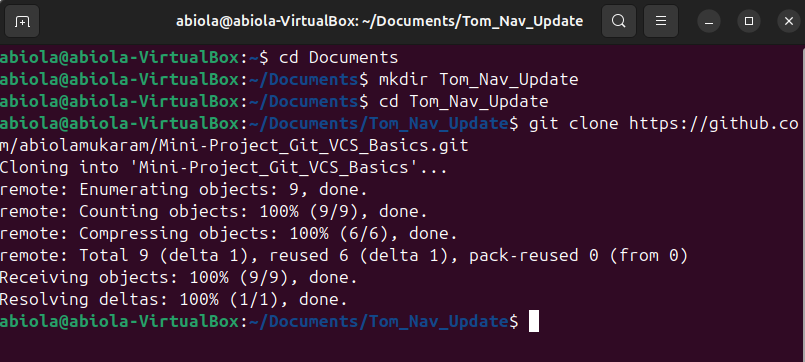 

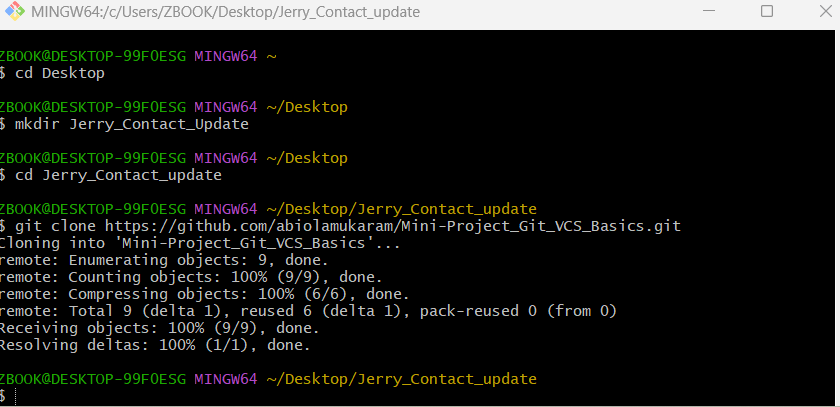 

- **Step 2:** 
Tom and Jerry pull the repo to get the latest changes just to be sure.
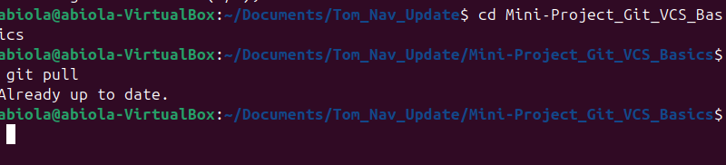 

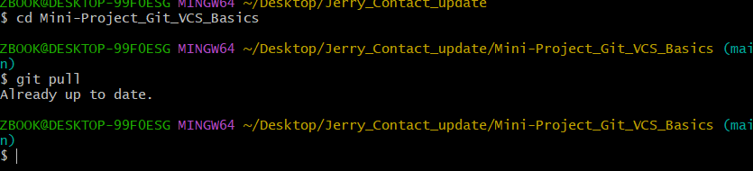 

- **Step 3:** 
Tom and Jerry create new branch for making individual changes on the central repo. 

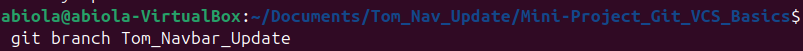 

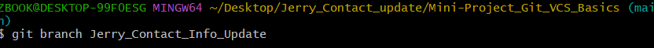 

- **Step 4:**
Tom and Jerry switching to the branch proper to carried out the update concurrently. 

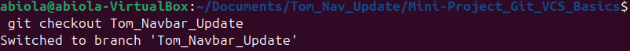

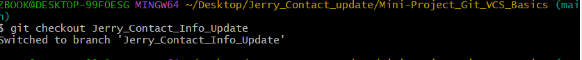 

- **Step 5:** 
Tom and Jerry makes changes to index.html by updating the navigation bar and also adding contact informations. 

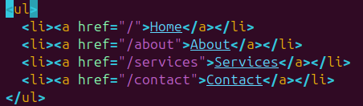

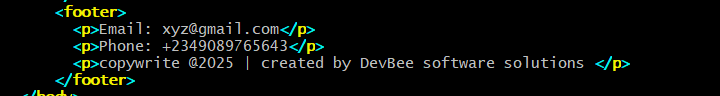

- **Step 6:** 
They both add and commit the change to index.html.

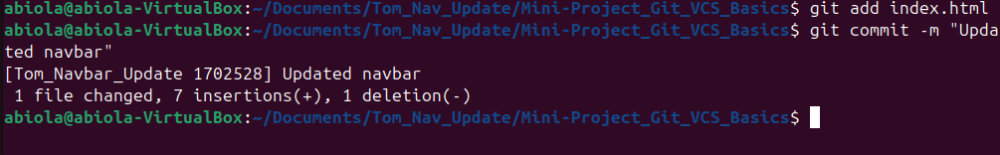 

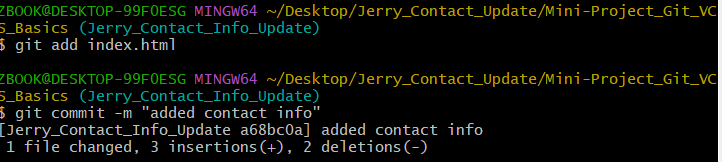 

- **Step 7:**: 
Tom pushed his code to his branch "Tom_Navbar_Update".

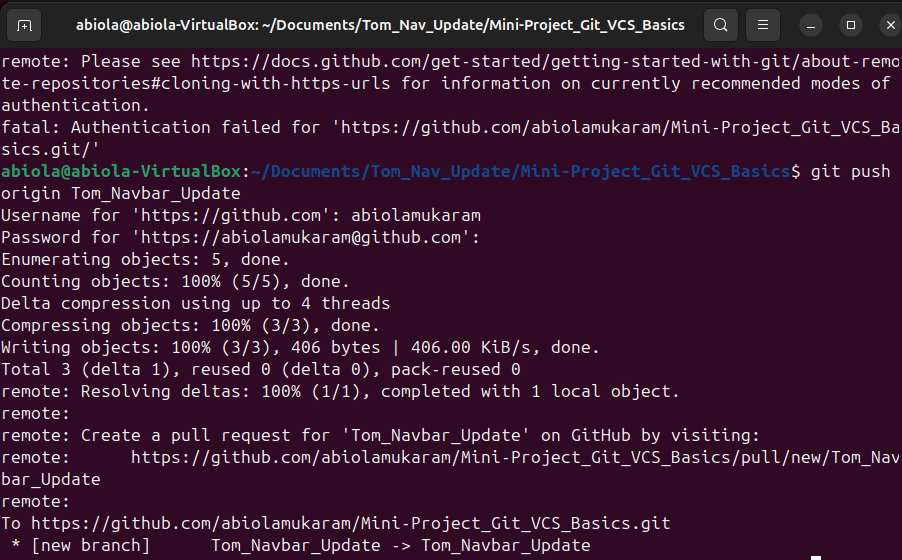

= **Step 8:**

Tom created a pull request then merged with the main branch after ensuring there was no conflict. 

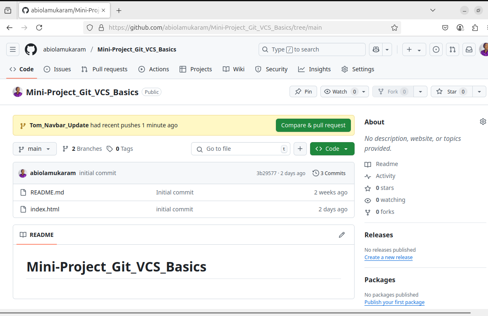
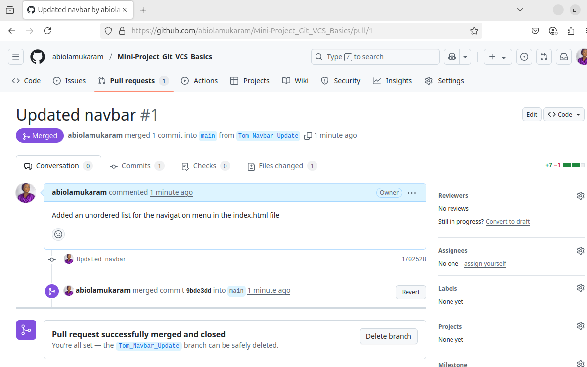

- **Step 9:**
Jerry updates is branch with latest main by checking out and also pull from main. 

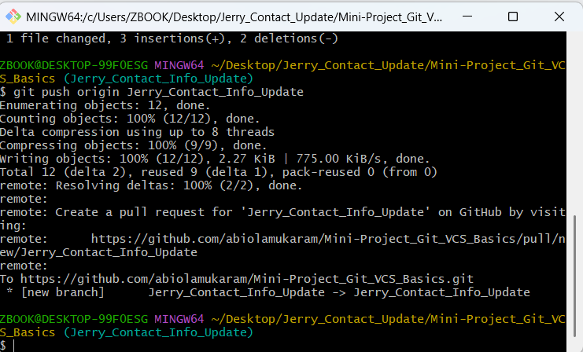 

- **Step 10:** 
Since there was no conflict Jerry after pushing a pull request was carried out.

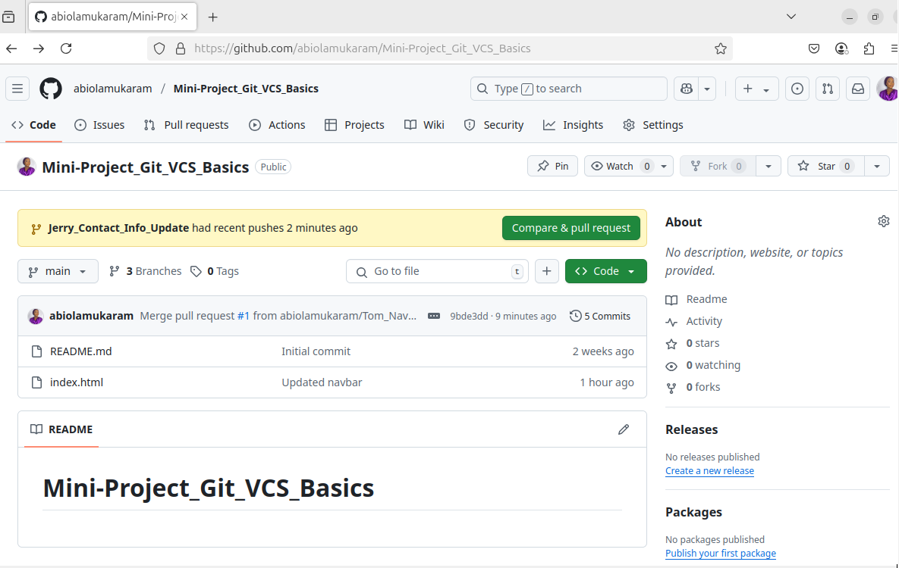
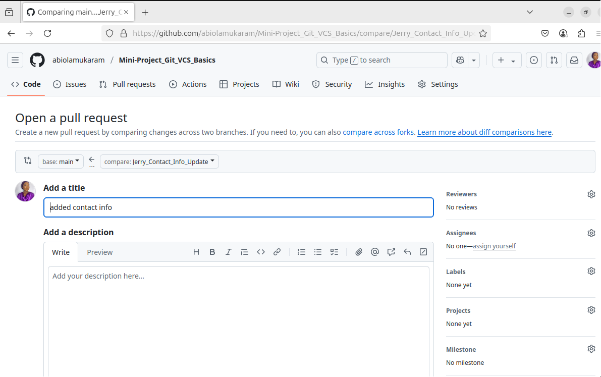
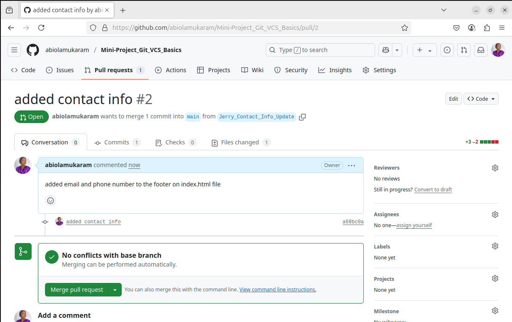
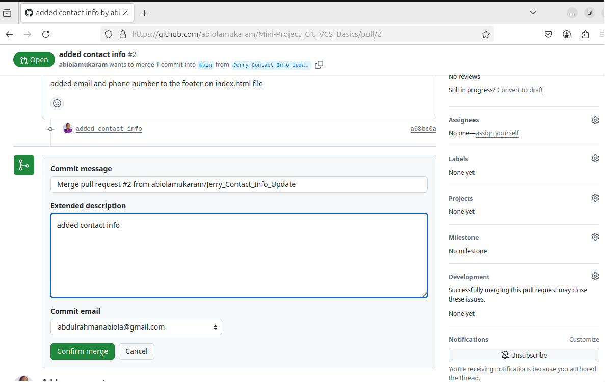
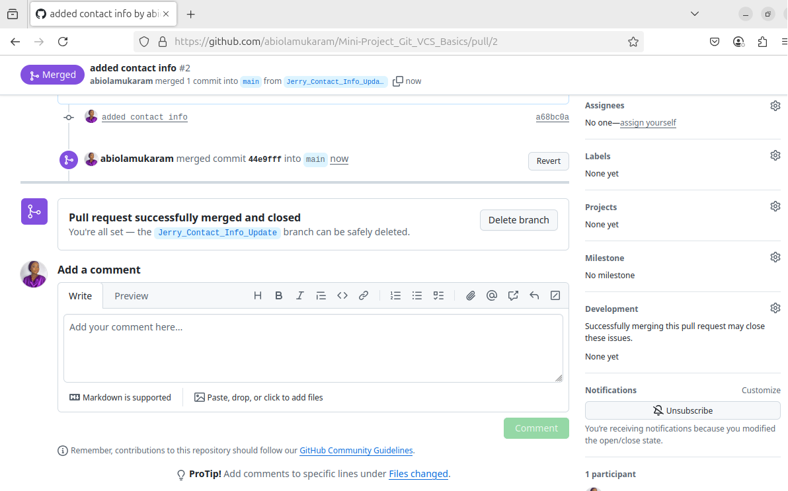

Both sets of changes (Tom’s and Jerry’s) are merged into the main project.
index.html now contains both the updated navigation bar and the new contact info in the footer. 
